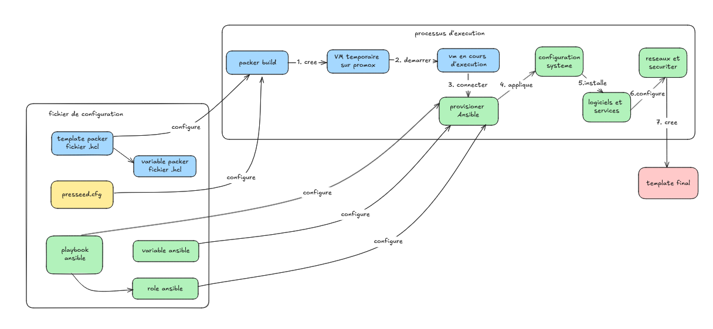

# Automatisation d'Infrastructure avec Packer, Preseed et Ansible

## Vue d'ensemble
Ce projet fournit une solution complète pour la création et la configuration de machines virtuelles en utilisant Packer, Preseed et Ansible. Il assure un déploiement rapide, sécurisé et standardisé tout en mettant en œuvre des mesures avancées de durcissement des systèmes.



## Architecture du Projet

Le workflow se compose de plusieurs étapes clés :

1. **Fichiers de Configuration**
   - Fichiers de template et variables Packer (.hcl)
   - Configuration Preseed pour l'installation automatisée de Debian
   - Playbooks et rôles Ansible pour le durcissement système

2. **Processus d'Exécution**
   - Packer crée une VM temporaire sur Proxmox
   - La VM est configurée selon les spécifications de base
   - Le provisionneur Ansible applique les configurations système
   - Le template final est créé avec toutes les mesures de durcissement

## Structure des Répertoires
```
.
├── ansible/
│   ├── group_vars/       # Variables de groupe Ansible
│   ├── roles/           # Rôles Ansible pour configurations spécifiques
│   │   ├── aide/        # Surveillance d'intégrité des fichiers
│   │   ├── auditd/      # Audit système
│   │   ├── clamav/      # Antivirus
│   │   ├── cron-hardening/
│   │   ├── fail2ban/    # Prévention des intrusions
│   │   ├── firewall-hardening/
│   │   ├── grub-password/
│   │   ├── kernel-hardening/
│   │   ├── lynis/       # Audit de sécurité
│   │   ├── packages/    # Gestion des paquets
│   │   ├── pam_faillock/
│   │   ├── passwords/   # Politiques de mot de passe
│   │   ├── post_deployment_report/
│   │   ├── rsyslog/     # Journalisation système
│   │   ├── ssh-hardening/
│   │   └── users/       # Gestion des utilisateurs
│   ├── hardened.yml     # Playbook principal de durcissement
│   └── inventory.ini    # Inventaire Ansible
├── preseed/
│   └── preseed.cfg      # Installation automatisée Debian
├── image/               # Ressources d'images
├── debian.pkr.hcl       # Configuration Packer
├── secrets.pkrvars.hcl  # Variables sensibles (gitignored)
└── README.md
```

## Fonctionnalités

### 1. Initialisation Système (Preseed)
- Création automatisée des utilisateurs avec authentification par clé SSH
- Configuration réseau (DHCP par défaut)
- Mises à jour initiales des paquets
- Amorçage de la configuration système

### 2. Création d'Image (Packer)
- Création automatisée de template Debian
- Intégration du fichier Preseed pour l'installation sans surveillance
- Gestion sécurisée des variables sensibles
- Intégration avec l'environnement de virtualisation Proxmox

### 3. Durcissement Système (Ansible)
- Mesures de sécurité complètes :
  - Gestion et durcissement des services
  - Application des permissions système
  - Configuration de la journalisation
  - Implémentation des règles de pare-feu
  - Optimisation des paramètres du noyau
  - Politiques de mots de passe
  - Durcissement SSH
  - Audit système

## Prérequis

- Proxmox VE (testé avec version 7.x+)
- Packer (version 1.8+)
- Ansible (version 2.9+)
- Git pour le contrôle de version
- Accès SSH aux systèmes cibles

## Guide d'Installation

### 1. Configuration de l'Environnement
```bash
# Cloner le dépôt
git clone https://github.com/votreuser/projet-infrastructure.git
cd projet-infrastructure

# Créer le fichier de secrets (ne pas commiter ce fichier)
cp secrets.pkrvars.hcl.example secrets.pkrvars.hcl
```

### 2. Configuration
1. Éditer `secrets.pkrvars.hcl` avec vos variables spécifiques
2. Modifier `preseed/preseed.cfg` si nécessaire pour votre configuration Debian
3. Revoir et ajuster les rôles Ansible dans `ansible/roles/` selon vos besoins de sécurité

### 3. Construction de l'Image
```bash
# Valider la configuration Packer
packer validate -var-file=secrets.pkrvars.hcl debian.pkr.hcl

# Construire l'image
packer build -var-file=secrets.pkrvars.hcl debian.pkr.hcl
```

### 4. Application du Durcissement
```bash
# Exécuter le playbook Ansible
cd ansible
ansible-playbook -i inventory.ini hardened.yml
```

## Description du Workflow

Comme illustré dans le schéma :

1. **Phase de Construction Initiale**
   - Packer initie le processus de construction
   - Crée une VM temporaire sur Proxmox
   - Applique la configuration de base

2. **Phase de Configuration**
   - Configuration système via Ansible
   - Application du durcissement de sécurité
   - Configuration des services
   - Implémentation de la sécurité réseau

3. **Création du Template**
   - Génération du template final
   - Prêt pour le déploiement

## Considérations de Sécurité

- Toutes les informations sensibles sont stockées dans `secrets.pkrvars.hcl` (gitignored)
- Le durcissement système suit les meilleures pratiques de l'industrie
- Les mises à jour de sécurité régulières sont configurées
- Journalisation et surveillance complètes
- Application du principe du moindre privilège

## Améliorations Futures

- [ ] Intégration de Terraform pour une infrastructure complète en tant que code
- [ ] Framework de tests automatisés
- [ ] Documentation étendue pour les modules Ansible personnalisés
- [ ] Intégration de la surveillance


## Auteur

**[Faria Jean-Baptiste](https://www.linkedin.com/in/faria-jean-baptiste/)** – Créateur du Projet

## Licence

Ce projet est sous licence MIT - voir le fichier `LICENSE` pour plus de détails.
